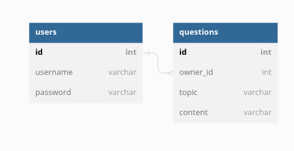

# Debug Challenge

Check out the following files and fix them to fulfill their purposes:
1. `cli\alphabet.php`
2. `cli\filter_array.php`
3. `cli\link.php`
4. `cli\random_name`

## Web + Database debugging

We are using the following database:

<!--
https://dbdiagram.io/

Table users {
  id int [pk,increment]
  username varchar
  password varchar
}
Table questions {
  id int [pk, increment] // auto-increment
  owner_id int
  topic varchar
  content varchar
}
Ref: questions.owner_id > users.id

-->

The two PHP scripts (`web\login.php` and `web\action_delete.php`) have potential issues.

Find and fix as many as possible.